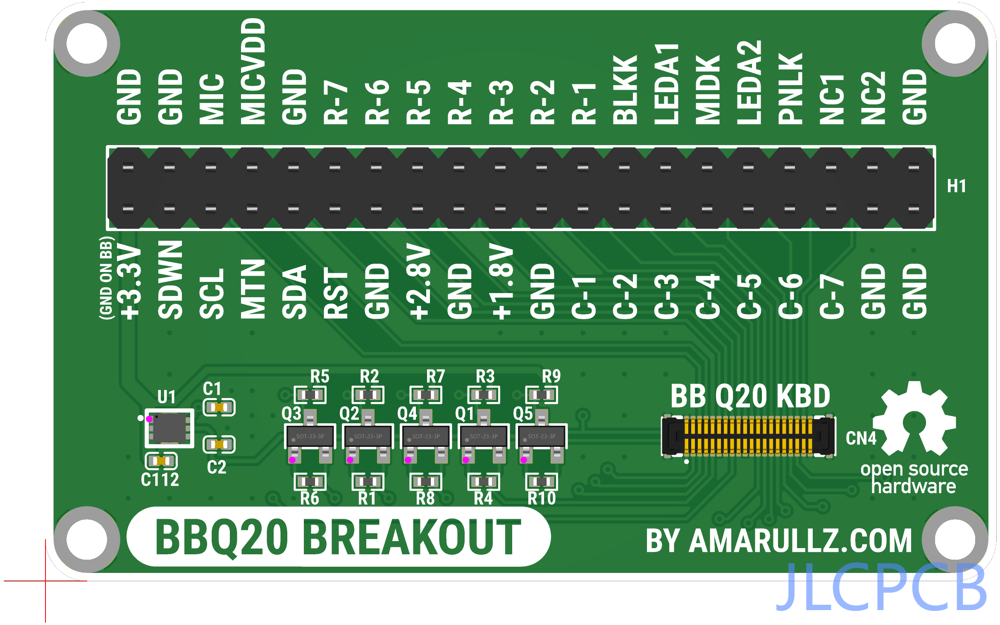

# BBQ20 Breakout Board

BBQ20 Breakout Board is simple Keyboard connector breakout PCB for easier hacking and development of `Blackberry Q20` keyboard. It's open-source hardware under GPL.

This PCB is just a hobby project, hope it's useful.

## EDA

I know, but I design it on easyeda for easy individual order/manufacturing (on jlcpcb, not sponsored - you hear it jlc 😚?)

## Design

## OSHWLAB

-  https://oshwlab.com/amarullz/bbq20breakout

